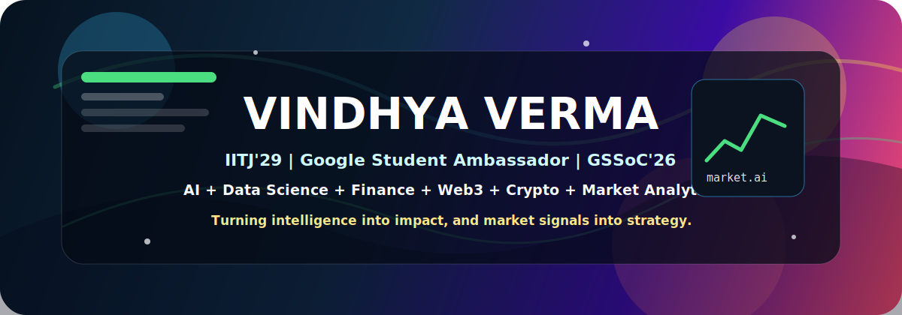
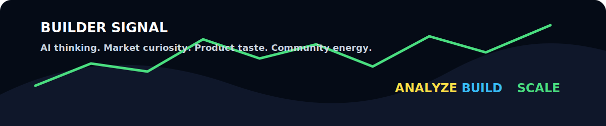
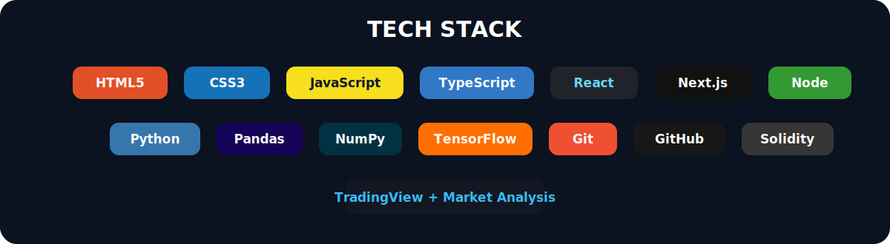
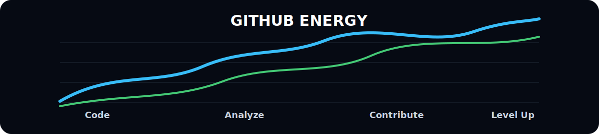
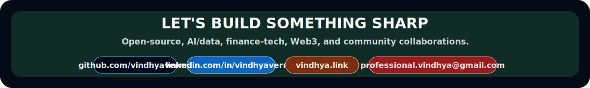

<div align="center">

<!-- Animated GitHub profile README for vindhyaverma -->

# VINDHYA VERMA



<a href="https://github.com/vindhyaverma"></a>
<a href="https://www.linkedin.com/in/vindhyaverma"></a>
<a href="https://vindhya.link"></a>
<a href="mailto:professional.vindhya@gmail.com"></a>


</div>

## About Me

I am **Vindhya Verma**, an **AI and Data Science student at IIT Jodhpur**, a **Google Student Ambassador**, and a **GSSoC'26 open-source contributor**. I build around the places where intelligence, markets, products, and communities meet.

My GitHub is shaped around **AI**, **data science**, **finance**, **Web3**, **crypto**, **stock market analysis**, and polished digital experiences that feel sharp from the first second.

```txt
Name        : Vindhya Verma
Institute   : Indian Institute of Technology Jodhpur
Location    : Delhi, India
Identity    : IITJ'29 | Google Student Ambassador | GSSoC'26
Focus       : AI, Data Science, Web3, Finance, Full-stack Development
Interests   : Crypto, Stock Markets, Analytics, Product Building
Signal      : Build intelligent things. Present them beautifully. Keep improving.
```

<div align="center">


</div>

## What I Bring

- AI and data science thinking with a builder's execution speed.
- Finance, crypto, markets, and analytics curiosity with product instincts.
- Web3 and emerging-tech energy shaped by real-world use cases.
- Open-source momentum through GSSoC'26 and community-first learning.
- A profile designed for recruiters, collaborators, founders, and serious builders.

<div align="center">



</div>

## Tech Stack

<div align="center">



</div>

## GitHub Energy

<div align="center">



</div>

## Let's Connect

I am open to **open-source collaboration**, **AI/data projects**, **finance-tech ideas**, **community opportunities**, and conversations with people who want to build things that look good, work hard, and matter.

<div align="center">



<a href="https://github.com/vindhyaverma">GitHub</a> |
<a href="https://www.linkedin.com/in/vindhyaverma">LinkedIn</a> |
<a href="https://vindhya.link">Website</a> |
<a href="mailto:professional.vindhya@gmail.com">Email</a>

</div>
